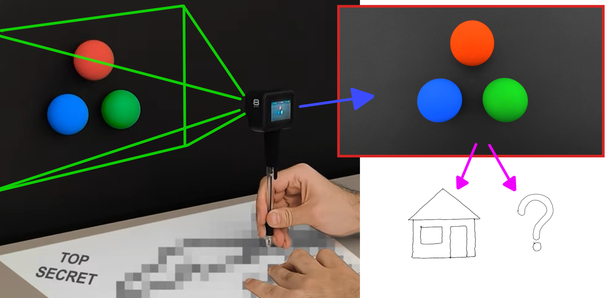
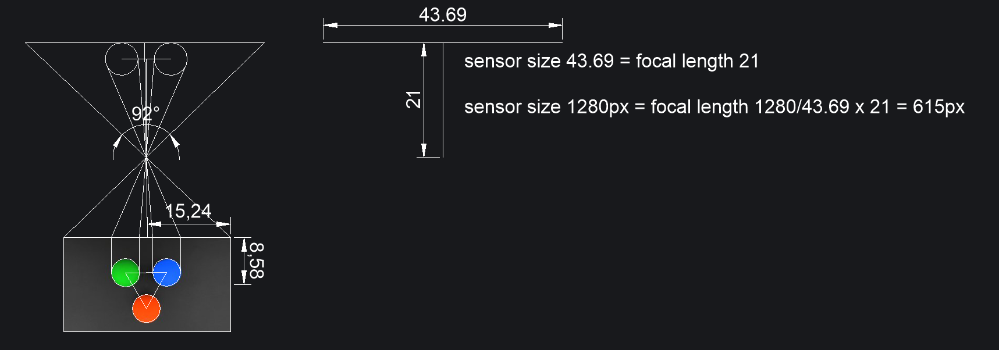
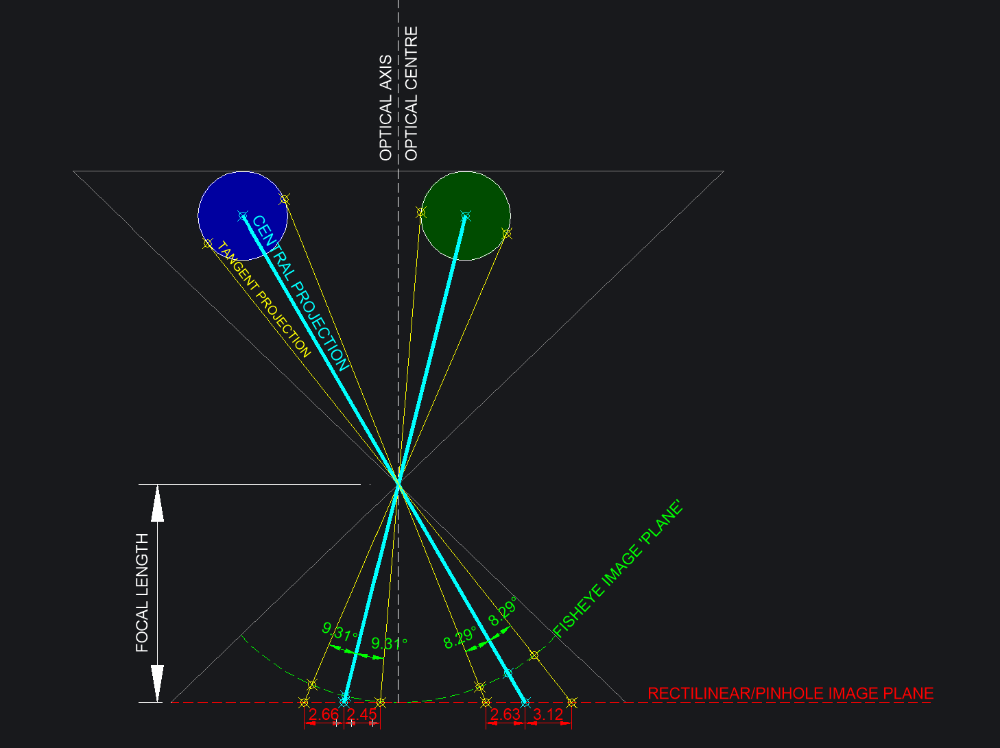
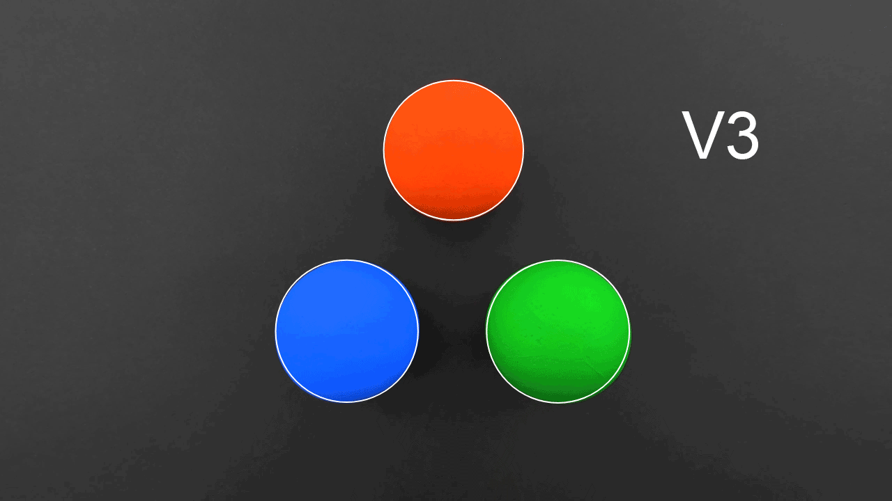
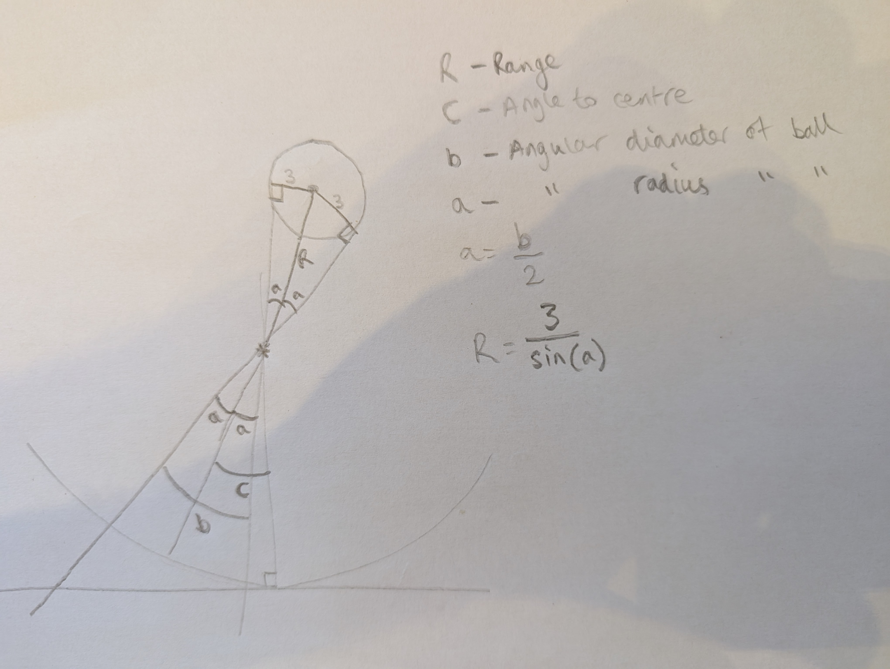
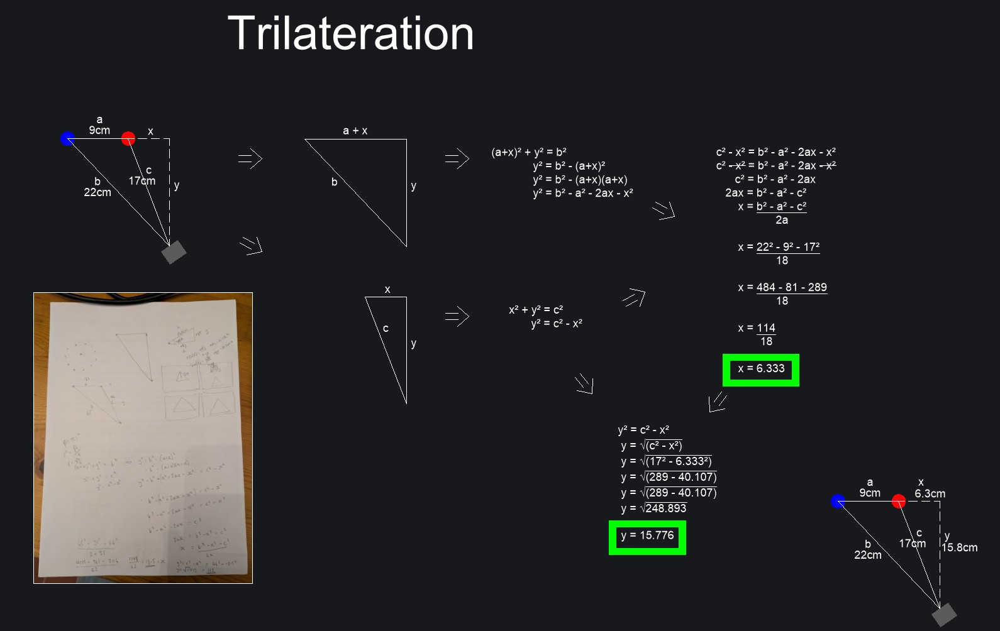
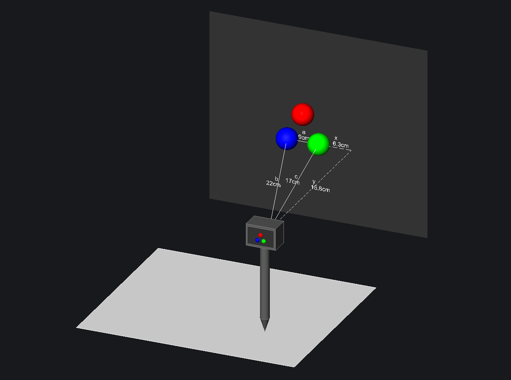
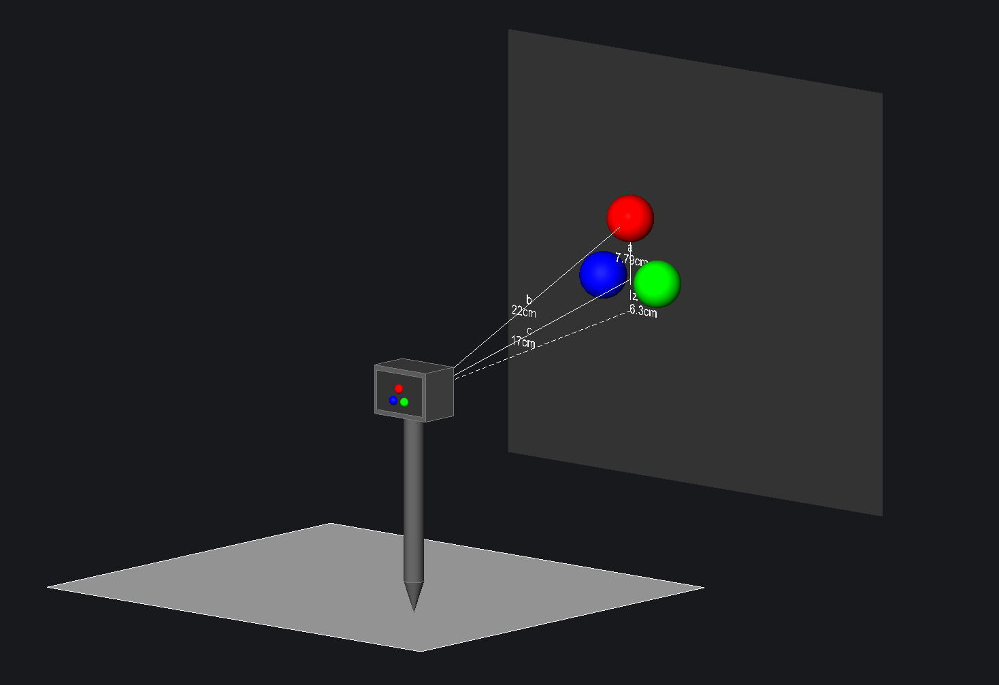
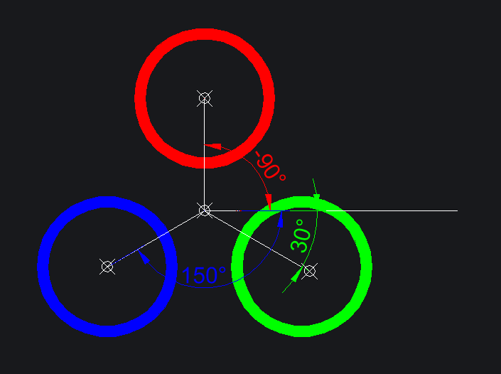
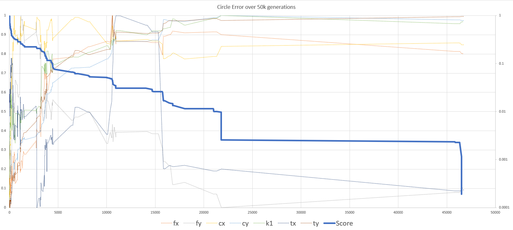

# Radu's 'Decode the Drawings' Coding Competition - Final Submission

# Contents
1. [Introduction](#introduction)
2. [About me](#about-me)
3. [My Results](#my-results)
4. [Usage](#usage)  
    - [Video Decoding](#video-decoding)
    - [Data file Decoding](#data-file-decoding)
    - [Decoding parameters/options](#decoding-parametersoptions)  
5. [My Solution(s)](#my-solutions)
    - [Stage 1 - Ball Detection](#stage-1---ball-detection)
    - [Stage 2 - Decoding](#stage-2---decoding)  
        1. [Radial Distortion Correction](#21---radial-distorion-correction)
        2. [Convert to angular coordinates](#22---convert-to-angular-coordinates)
        3. [Find centroid and radius of balls](#23---find-the-centroid-and-radius-of-each-ball)
        4. [Find distance to each ball](#24---find-the-distance-of-each-ball-from-the-camera)
        5. [Find XY using trilateration](#25---work-out-xy-camera-position-using-trilateration)
        6. [Find Z using trilateration](#26---work-out-z-camera-position-using-trilateration)
        7. [Estimate pitch and roll](#27---estimate-pitch-and-roll-of-camera)
        8. [Check Z for pen contact](#28---check-the-z-value-to-determine-contact-with-the-drawing-surface)
        9. [Mapping paper coordinates to canvas pixels](#29---mapping-the-coordinates-from-real-world-cm-to-canvas-pixels)
6. [The Genetic Algorithm](#the-genetic-algorithm)

# Introduction

**Competition website and video**  
<https://radufromfinland.com/decodeTheDrawings/>  
<https://www.youtube.com/watch?v=bZ8uSzZv0ew>

Radu recorded 6 videos with a camera mounted on top of a pen as he drew different shapes/pictures while the camera pointed at three coloured balls attached to a wall.

The challenge was to track the balls in the video and use their relative positions and motion to decode what was being drawn as the camera moved with the pen.

Something like this:

The amount of effort that Radu went to to conceive of and execute this competition, along with all the other top quality free educational material on his YouTube channel, is mind-boggling.

# About me

Though I didn't intend to get dragged quite so far into this competition, it did appeal to me as I have long had an interest in computer vision.

I feel like I should disclose that I studied Computer Science and AI at the University of Sussex between 2000 and 2004, and both my BSc and MSc dissertations were computer vision related. I was far from a brilliant student, but I enjoyed it.

I've had a 20+ year career in technology-related roles, though I was only ever employed as a coder until 2007. My job for the last 17 years has been general 'technical support' for a small engineering consultancy based in Cambridge, UK, and though coding is not part of the job description, it makes the job easier!

I learned Java at Sussex, and VB in my first coding job. It wasn't until the covid pandemic that I started to learn and use JavaScript on a regular basis.

I'm not afraid of a large coding project, and have deployed several complex desktop and web apps at work, but I lack the knowledge of how actual software development is done in the industry, and certainly no-one else at my work has the faintest idea...

From what I have seen of the software devlopment world, I'm probably in a career sweet-spot right where I am.

# My Results

You can find the XY image coordinate TXT files at `results/coords_#.txt`. Here are the decoded drawing images, scored on the competition test page (<https://radufromfinland.com/decodeTheDrawings/test/index.html>):

# Usage

To run this code on your own machine, you will need a local http server. I suggest Live Server for VS Code: <https://marketplace.visualstudio.com/items?itemName=ritwickdey.LiveServer>

There are two possible workflows:

1. Video Decoding - decoding an mp4 video file directly to see the resultant drawing
2. Data file Decoding - decoding a data file, derived from an mp4 video, to see the resultant drawing

Method 1 is necessary for previously unseen mp4 video files, and method 2 is preferred for reprocessing videos that have already been seen once, as it is much faster. I include the derived data files in the repository so you may skip straight to method 2, but method 1 is more enjoyable to watch the drawing take shape in real time.

## Video Decoding

Clone this repository to your system, and download the input videos from Radu here: https://kareliauas-my.sharepoint.com/:u:/g/personal/210618a_karelia_fi/ERgUAjdIjXxEhCTNa74-wIgBxhcLP8GLfGab8iiwHUaZDQ?e=7TPxK6

Copy the videos 1-6.mp4 to the videos directory and use a browser to access the index.html page on your local server. If you want to try with a different mp4 file, add it to the videos folder and follow the instructions within the index.html code to make the file selectable (just add another option to the video input select element)

After loading index.html in your browser, the top left video input should list the available input videos. Choose any one to load the video and watch the drawing take shape in the large square drawing canvas. 

You can't stop a video once it's started, unless you close/refresh the page, or choose another video.

Changing any of the decoding parameters will have no effect once the video decoding has started.

You'll need to scroll to the bottom of the page to see the video, which will also show overlaid outlines of the detected balls.

Once the video has reached the end, you can scroll further down, below the video to see two textareas. The left textarea shows the detected ball outline coordinates, and a button to download this. The textarea only shows a truncated preview, so use the button to download the full version, and use it as described below in `Data file Decoding` for more rapid decoding, to test different parameters.

The right textarea shows the pixel coordinates of every point in the decoded image, and this can be downloaded for submission to the test page (<https://radufromfinland.com/decodeTheDrawings/test/index.html>) or however you choose!

Video decoding has a couple of other limitations compared to data file decoding. The 'check circle fit' option has no effect in video decoding mode, and the canvases to the side of and below the main drawing canvas do not show the side and front view of points in 3D, as they do in 'data file mode'.

## Data file Decoding

After cloning this repository you should find a zip file in the data directory, containing the detected ball outlines for each frame of the 6 input videos.

Extract these 6 files to the data directory, or add files that you generated using method 1 above. If you generated a file for a different video than the 6 provided, you will need to add an option to the data file select element in the index.html file, and the specific details of how to do this are described within the index.html file.

Now, after loading the index.html page, you can choose the relevant data file input from the data file input dropdown, and it should be very quickly decoded and displayed in the main drawing canvas.

Now any changes to the decoding parameters will cause the input file to be processed again with the new settings, so you can get instant feedback on the effect of the parameter change.

## Decoding parameters/options

These parameters and options will be described in more detail further below, but here is an overview.

Changing these parameters while a video is being decoded will have no effect until the next video is loaded. They also have no effect until a data file is loaded, but changing them will automatically trigger reloading the current data file if one is selected, which gives the illusion of them having an instant effect in that case.

These parameters are preset with good default values that I have determined through manual trial and error, starting from sensible estimates.

- **Smoothing**: Default 0.9  
Smoothing is applied to the calculated centroid and radius of the balls in subsequent frames, before further processing is applied.  
This is the weight of effect of the previous frame on the current frame. So if smoothing is 0 the previous frame has no influence, and if smoothing was 1 the current frame would have no influence (and so nothing would ever change). 
- **Z Threshold**: Default 3.45 (cm - height of the camera relative to the green and blue balls)  
The decoder calculates an XYZ position for the tip of the pen at each frame. The Z Threshold allows you to set a Z level above which to ignore the pen as it is likely not in contact with the drawing surface.
- **Focal Length**: Default X=615, Y=615 (pixels)  
It's possible for lenses to have different focal lengths in different directions, though the difference is normally very small. This relates to how wide or narrow the field of view is, and is used in the decoder to work out the angle between things in the scene and the camera's optical axis. The value of 615 pixels was calculated based on the known size of, and distance to, the balls in frame 1 of the first video, and I haven't yet found a better value!  

- **Optical Centre**: Default X=664, Y=389.8 (pixels)  
This is the coordinates of the pixel on the sensor which captures light which passed directly though the lens without any deviation from a straight path (refraction)  
It should be the middle, but lenses and sensors are not always placed in cameras to this level of precision
This is the baseline from which i measure angles to objects (balls) in each frame
- **Distortion K1**: Default 0.000000319  
The K1 coefficient is used to correct for first order radial distortion (barrel/pincushion) where the magnification varies in the image with distance to the optical centre
- **Tilt Factors**: Default X=150, Y=250  
These are slightly hacky fudge-factor numbers of arbitrary scale and meaning  
I make a simplistic estimate of whether the camera is tilted forwards/backwards/sidewards, and by how much, and multiply that amount by these numbers to get an XY offset from the camera position to the pen tip position.
Without this, we are only tracking the position of the camera, and not accounting for the fact that the pen tip is somewhere else if the pen is not completely vertical.
- **Ball Radius**: Default 3.19 (cm)  
Though we know the balls to have a radius of 3cm, I found that I got better results by making this a variable and adjusting it up to 3.19cm. This implies some error in my code/maths that I have not yet identified.
- **Check Circle Fit**:  
This only works when decoding data files, and only makes sense when doing it for data file #1, but this will calculate a best fit circle for the current decoded drawing and display an error value indicating how far the drawing is from perfectly fitting it.  
The circle fitting algorithm is non-deterministic so you will get slightly different results for the same input, so try it a few times on and off, or with different parameters to get a 'feel' for the true value!  
At the last minute before the submission deadline, I found that I could get a much lower circle error with different parameters, but the other drawings didn't look quite so good, and the score on the test page was a couple of % lower, so I discarded them, but there may still be room for improvement by simply tweaking all these values.

# My Solution(s)

This submission is my 5th and final version, after trying several different approaches. 

Versions 1-3 can be found here (<https://github.com/epipolarity/Decode-Drawings>) reasonably well documented.

Version 4 can be found here (<https://github.com/epipolarity/Decode-Drawings-V4>) but this was a failed attempt to use PnP pose estimation, and it never seemed worthwhile to document it because it didn't work. This was the only version for which I used any external libraries and consulted with LLMs to understand the maths. I feel like every time I attempt to get my head around linear algebra I get a little closer, but then need a few years recovery before trying again...

This is Version 5, which is closely related to Version 3 but with an approach based on angles relative to the camera optical axis, rather than pixel coordinates in the image plane.

The reason for this change was that I was not happy with my method in V3 for correcting for the elongation effect, observed on the image plane in a pinhole camera as objects move futher from the centre.

The difference between the two approaches (pixel based vs angle based) can be seen in the below image.

The red line at the bottom represents the standard image plane. This is the image sensor in most cameras, and it has the desirable property that lines which appear straight in the real world (the edges of a building, for example) always also appear straight in the image. This model also has the undesirable property that objects appear elongated the further they are from the optical centre. Notice that the midpoint of each ball is not projected to the midpoint of where the edges of the ball appear in the image plane. 

This was the reason my V3 decoder struggled, as I did not have a good method for compensating for this elongation. I had a bad method, based on correction factors, based on observervation, but not based on geometry.

The green line in the image above represents my solution to this, which I believe is related to the fisheye camera projection model. This does not preserve straight lines in an image, but has the desirable property that the mid point of the ball is projected to the mid point of where the edges of the ball are projected on the image 'plane' (actually the surface of a sphere). In this model, image coordinates are treated as angles from the optical centre, rather than cartesian coordinates on a plane. 

We still have to convert from cartesian pixel coordinates to these angular coordinates, but this is possible if we know (or estimate) the camera focal length and optical centre, and much simpler than what I was doing with correction factors previously.

## Stage 1 - Ball Detection

The first stage of the process is to detect the balls in each video frame. In versions 1-4 I used the same approach, described here (<https://github.com/epipolarity/Decode-Drawings#2-ball-detection>) based entirely on the Marker Detection algorithm described by Radu here: <https://www.youtube.com/watch?v=jy-Mxbt0zww>.

For this version, I gave the detection algorithm a slight upgrade - it now outputs the outline of each ball as a series of 2D pixel coordinates, rather than just outputting the centroid and radius.

This was necessary for two reasons.

1. As described above, the balls are elongated in the frame, not circular, and the center of the ball is not at the center of the elongated shape (it's slightly closer to the optical centre).
2. To correct for radial lens distortion and this elongation effect we need to treat each part of the ball outline differently, as they all have different distances from the optical centre, and a series of points around the edge of the ball is one way to do this.

See the difference in detection methods in the animated gif below, and note how the previous method does not conform to the subtle elongation of the balls (most notable in green and blue).

The detection algorithm starts with Radu's marker detection method to establish a good estimate of the centroid and radius, but rather than stop there it uses these as a starting point for a process to iteratively refine the outline. 

For each point in the outline, it searches a 7x7 pixel area centred on that point, and counts the number of pixels in that area that exceed the given colour strength threshold. If more than half the points exceed the threshold the point is deemed to be too close to the ball centre, and it moves outwards (relative to the mean position of all points) and if fewer than half the points exceed the threshold it moves towards the centre. It repeats this process for a maximum number of iterations, or until converging close enough to a location where the number of points that exceed the threshold balances those that do not, and we take this to be the edge of the ball.

This method works well despite the obvious issues that there is no way for half of the pixels in an odd number (49) to balance the other half, and that actually slightly fewer than half of the pixels in a square centred on the edge of a circle (or ellipse) would actually be contained by that circle (or ellipse)!

There are certainly better and more generalised algorithms for calculating the contour of a shape, but I enjoyed the process of developing this one myself, and this is a common theme throughout this project and my work in general!

## Stage 2 - Decoding

This is the process of taking the detected ball outline pixel coordinates, and processing them to infer the 3D position of the camera, and attached pen tip.

The steps in this process are:

1. Apply radial distortion correction to the pixel coordinates, to correct for barrel/pinchusion distortion
2. Convert these undistorted pixel coordinates to angular coordinates, to remove the elongation effect
3. Find the centroid and radius of each 'un-elongated' ball outline
4. Use the radius of each ball to estimate its distance from the camera
5. Use trilateration to work out the position of the camera in the horizontal plane, i.e. its position over the drawing surface, using the distances to blue and green balls found in #4
6. Use trilateration to work out the position of the camera in the vertical plane, i.e. its height over the drawing surface, using the distance to the red ball, and mean of distances to the blue and green balls.
7. Estimate the pitch and roll of the camera to estimate the relative position of the pen tip which is not directly below the camera when the pen is tilted.
8. Check if z exceeded the z threshold, or if z changed too fast, to determine if the pen was on the drawing surface or not
9. Map the calculated xy coordinates from cm units to pixels on the canvas

### 2.1 - Radial Distorion Correction

I use the simplest version of radial distortion correction (division model), as described here https://en.wikipedia.org/wiki/Distortion_(optics) using a single coefficient to remove the largest effects of any radial distortion. 

Radial distortion is a lens effect caused by the optics of the lens used in the camera, resulting in differing levels of magnification of the image, dependent on distance from the optical centre. Removing this distortion should get us closer to a pinhole type camera, where the only distortion is elongation caused by the pinhole model itself.

This was applied to each point in each ball's outline, and is a very slight adjustment that can be seen to make quite a difference to the final output.

### 2.2 - Convert to angular coordinates

I use basic trigonometry to convert from pixel coodrinates to angular coordinates. Using the identity: 

$$tan(\theta) = \frac{opp}{adj}$$

We just have to rearrange to:

$$\theta = tan^{-1}(\frac{opp}{adj})$$

Where the opposite length is the distance of each point from the optical centre, and the adjacent length is the camera focal length.

### 2.3 - Find the centroid and radius of each ball

Now that the points on the ball outline are free from elongation and lens distortion, we find the centre by taking the average of all points in the outline. This is valid so long as the points are evenly spaced. There is no mechanism in the outline detection algorithm for enforcing that the points are evenly spaced, such as repulsive or attractive forces used in some implementations but, because points are only able to move in the direction of the mean of all points in the outline, the spacing is preserved.

We then find the radius by taking the average distance from each point in the outline to the centroid calculated above.

### 2.4 - Find the distance of each ball from the camera

This is where the angular coordinates method really makes things simple. In the previous, image plane pixel-based method the range was a function of the apparent size of the ball and also its location in the image, but with this method it is purely a function of its apparent size, which is given by the radius calculated above.

Due to being a little squeezed for time, I shall re-use my pencil scribblings to illustrate this!

I was surprised when the answer popped out so simply, as evidenced by the fact that I started by including a lot of variables that turned out to be completely redundant.

The step skipped in the illustration is identifying that the right angle triangle with angle $a$, hypoteneuse $R$ and opposite length, ball radius $3$ is all that is needed, and $R$ can be found using the identity:

$$sin(\theta) = \frac{opp}{hyp}$$

Into which we substitute our known values:

$$sin(a) = \frac{3}{R}$$

and rearrange to find $R$ (range, or distance, to the ball):

$$R = \frac{3}{sin(a)}$$

In practice I replaced $3$ with a tunable variable for ball radius, which gave better results with a slightly higher value, even though we know $3$ (cm) to be the actual radius.

The triangle is a right angle triangle, because the observed edges of each ball define a ray from the camera viewpoint to a point tangent to the ball surface, and such tangents are always perpendicular to the centroid of a circle/sphere.

### 2.5 - Work out XY camera position using trilateration

My trilateration method for XY position has not changed since version 3, so I will re-use the same illustration of the derivation, which was initially also scrawled in pencil (full size image available in `./images/`).

I will add to that by including the following diagram to illustrate better how this was used in the horizontal plane. 

Distances $b$ and $c$ are the 'ranges' $R$ to each ball as found in 2.4 above, distance $a$ is the known 9cm between balls, and $x$ and $y$ are the horizontal position of the camera relative to the green ball (erroneously shown red in the image above).

Drawing it out like this (on the day of the extended competition deadline), I immediately see the shortcomings of this method which only truly works if the camera is at the same height as the blue and green balls. We know for a fact that the camera is usually about 4cm higher up than these balls, and this value changes with tilt and when the pen is lifted, but it's still close!

### 2.6 - Work out Z camera position using trilateration

To calculate the Z position of the camera, we use the same approach as above, but rotate the triangles 90 degrees:

Now distance $b$ is that to the red ball, and distance $c$ is the average of distances to the blue and green balls. $z$ is the vertical distance below the blue and green balls, and since we noted above that the camera will always be higher than these balls this explains why my $z$ value is always negative, which my code comments show was previously put down to getting something backwards. Well this was it!

### 2.7 - Estimate pitch and roll of camera

My methods for estimating the tilt of the camera, and therefore the pen, and therefore the XY offset to the pen tip from the camera position, are a little crude, but they were good enough to improve the accuracy of the decoded images somewhat.

**Pitch**

To work out if the camera is tilted forwards/backwards, we first estimate the angle that we would expect the red ball to be at if the camera was facing straight forwards, using:

$$\theta = sin^{-1}(\frac{opp}{hyp})$$

Where $\theta$ is the expected angle, $opp$ is the known height of the red ball above the triangle center, and $hyp$ is the range/distance to the red ball.

We then compare this to the actual position in $y$ at which we see the red ball (which is already in radians) and multiply the difference by a fine-tuned correction factor to get a useful $y$ correction value.

I notice in the code I seem to be treating the height of the triangle as 9cm, when it is in fact 7.79cm. Putting 7.79 in as the value now makes the results much worse, and tweaking the y-correction factor doesn't seem to help, so I'll leave this error in for now!

**Roll**

To work out if the camera is tilted sideways, we calculate the average angle from the centre of the three balls to each ball.

We compare this to the expected average angle (which isn't zero because the angles are taken from horizontal rather than vertical).

As shown above, the expected average angle is 30°

$$\frac{30 + 150 - 90}{3} = 30° = \frac{\pi}{6}$$

This is fine so long as the camera doesn't roll too far and the angles wrap round!

The difference between this expected angle, and the observed angle is then multiplied by another fine-tuned correction factor to get a useful $x$ correction value.

### 2.8 - Check the Z value to determine contact with the drawing surface

We do two checks to determine if the pen is in contact with the drawing surface.

1. Check if Z is above a fixed threshold value
2. Check if Z changed too much relative to total XYZ movement ('too much' is currently a hard coded value of 0.4)

Well the second one is almost what it does. I just noticed that my distance function ignores Z so it is really only comparing Z movement to XY movement. 

The idea is that if the pen moved up or down by more than the amount of noise in the measurement, then whatever Z it was at at the start or end of that movement, it won't have drawn anything while it was going up or down. 

If the coordinates pass these two checks then they are added to the 'collector' - an array that holds the coordinates of the decoded drawing. If they fail either check they are added to a 'rejected' array which is still available to the UI to plot, to show what was filtered out.

### 2.9 - Mapping the coordinates from real world cm to canvas pixels

For this bit I simply console logged all coordinates, and scanned up and down visually to get the rough min and max values, and mapped those to where i wanted them to appear on the canvas. I later tweaked these values a bit to get uniform scaling and add a bit of a border, but it was as simple as that.

# The Genetic Algorithm

I did implement a genetic algorithm, partly because I really wanted to (nostalgia for the early 2000s), and partly because I had said that I would in the discord channel, and definitely not because I thought it would work very well (it didn't).

The GA is kind of a spin-off standalone project, which you can find in the `./js/geneticAlgorithm` directory.

It's no longer applicable to this project because I later added more parameters to the decoder which are not present in the GA, and I only ran it once because it was so slow and I ran out of time.

Here is a plot of the progress over time. It looks better than it is, because I normalised the different data series to be in the range 0-1 to fit better in the graph, and I plotted the error on a logarithmic scale, so the diminishing gains in fitness are greatly exaggerated the lower they get!

I don't have time to document this further before the submission deadline, but the code is well commented, and the results are available in full in the `./results` directory for anyone interested.

I will just add that this was the one part of the whole project that I needed to run outside of the browser. I modified the code slightly so it could be run in either the browser or as a module in node.js, because at least in node I could leave it running, whereas in the browser it would stop everytime the screen went off or to the lock screen.